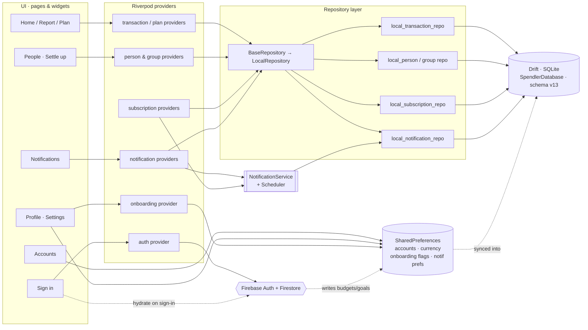

# CoinFlo — Screen Flow & Connectivity

Generated from `lib/core/router.dart`, `lib/pages/shell_page.dart`, and the
provider/repository layers. GoRouter uses a single `/home` route hosting a
4-tab `IndexedStack` (Home / Report / Plan / Settings) via
`selectedTabProvider` — there is no `ShellRoute`; every other screen is a
nested push route.

---

## 1 · Screen Flow (navigation)

```mermaid
flowchart TD
    Splash([Splash]) --> Gate{onboarded?<br/>returning user?}
    Gate -- no --> Welcome
    Gate -- yes --> Home

    subgraph OB[Onboarding · /onboarding/*]
        direction TB
        Welcome[Welcome] --> Currency[Currency]
        Currency --> OBAccounts[Accounts]
        OBAccounts --> Categories[Categories]
        Categories --> Budget[Monthly Budget · optional]
        Budget -. set limits .-> BudgetCats[Category Budgets]
        Budget --> Goals[Savings Goals · optional]
        Goals --> Reminders[Reminders]
        Reminders --> Recap[Recap]
        Recap --> Complete[Create account · optional]
    end
    Complete --> Home
    Welcome -- returning user --> SignIn
    SignIn[[Sign in]] -- sign in / continue on device --> Home

    subgraph SHELL[/home · IndexedStack tabs/]
        direction LR
        TabHome[Home] -.-> TabReport[Report]
        TabReport -.-> TabPlan[Plan]
        TabPlan -.-> TabSettings[Settings]
    end
    Home --> SHELL

    %% Global affordances on the shell
    TabHome -- bell --> Notifications[[Notifications]]
    FAB(("＋ FAB")) -- any tab --> QuickAdd[/Quick Add sheet/]
    SHELL --- FAB

    %% Home tab
    TabHome --> TxnList[[Transactions]]
    TabHome --> DailyView[[Daily View]]
    TabHome --> TxnDetail[[Transaction Detail]]

    %% Report tab
    TabReport --> ReportCat[[Category drill-down]]
    ReportCat --> TxnDetail

    %% Plan tab
    TabPlan --> GoalSheet[/Add / edit goal sheet/]
    TabPlan --> BudgetSheet[/Budget editor sheet/]

    %% Settings tab
    TabSettings --> Profile[/Profile sheet/]
    TabSettings --> Accounts[[Accounts]]
    TabSettings --> People[[People & Debts]]
    TabSettings --> Subscriptions[[Subscriptions]]
    TabSettings --> Saraswati[[Ask Saraswati]]
    TabSettings --> Excel[[Excel Import]]
    TabSettings --> Logout((Log out)) --> Welcome

    %% Profile sheet jump-offs
    Profile --> Accounts
    Profile --> Help[/Help & Support sheet/]
    Profile --> SignOut((Sign out)) --> Welcome

    %% People & debts
    People --> Person[[Settle up · /people/:id]]
    People --> Groups[[Groups]]
    Person --> ExpenseSheet[/Record / settle sheet/]
    Person --> TxnDetail
    Groups --> GroupDetail[[Group Detail]]

    %% Transactions
    TxnList --> TxnDetail
    TxnDetail --> Attachment[[Attachment Viewer]]

    classDef sheet fill:#F0F0F0,stroke:#A0A0A0,color:#0A0A0A;
    classDef screen fill:#FFFFFF,stroke:#0A0A0A,color:#0A0A0A;
    classDef nw fill:#0A0A0A,stroke:#0A0A0A,color:#FFFFFF;
    class QuickAdd,Profile,Help,GoalSheet,BudgetSheet,ExpenseSheet sheet;
    class Notifications,Accounts nw;
```

> Bold `[[...]]` nodes are full push routes; `/.../` nodes are bottom sheets
> (`showSpendlerSheet`); black nodes are the two screens added in the
> "More Screens" pass.

---

## 2 · Connectivity (data architecture)

How each screen reaches its data. UI never touches storage directly — it goes
through Riverpod providers → the repository facade → per-domain
implementations → Drift/SQLite, with SharedPreferences and Firebase alongside.



### Notes
- **Accounts** are stored as JSON in SharedPreferences under `accounts`
  (shared shape: `AccountModel`), not in Drift — both the Accounts screen and
  the Profile/onboarding read the same key.
- **Notifications** are real rows in the `AppNotifications` Drift table
  (`type`/`title`/`body`/`sentAt`/`isRead`), produced by the
  NotificationScheduler (check-in, digest, subscription) and surfaced via
  `recentNotificationsProvider`; the home-header bell uses
  `hasUnreadNotifProvider`.
- **Firebase** is login-only: on sign-in it hydrates local data, then
  onboarding budgets/goals in SharedPreferences are synced into Drift.
  Local-first ("Continue on this device") skips Firebase entirely.
