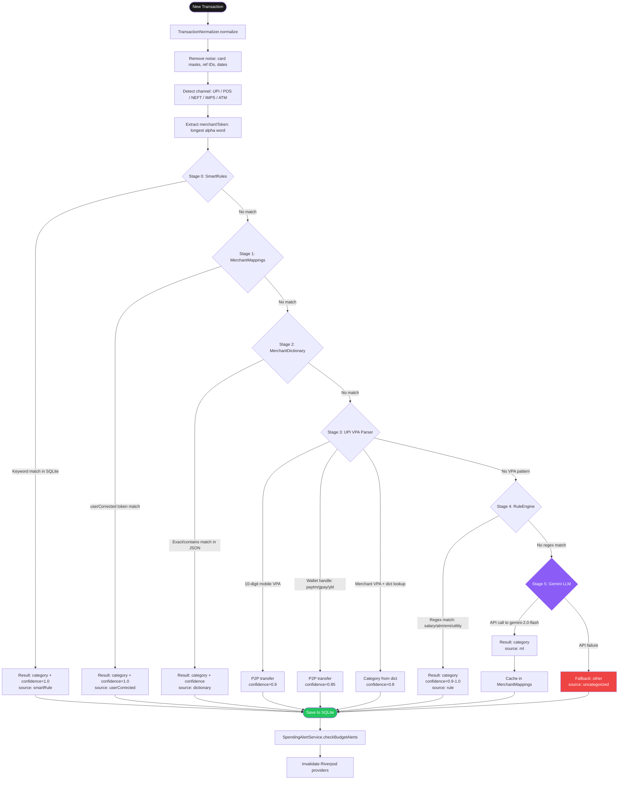
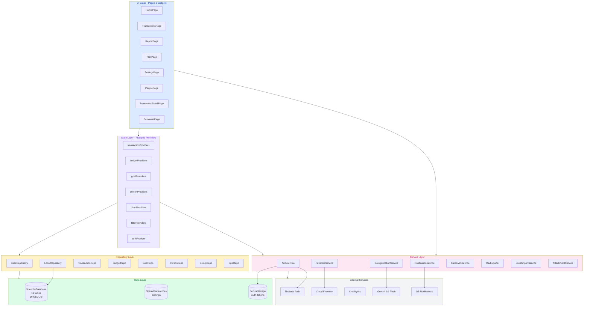
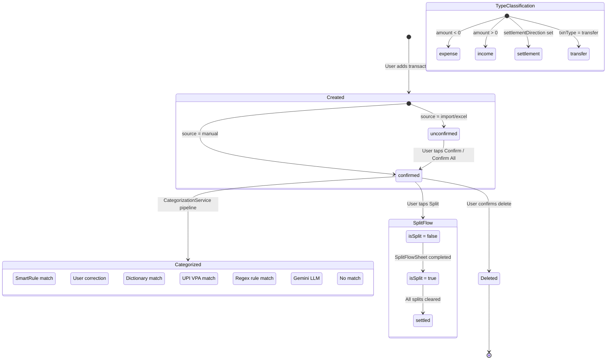
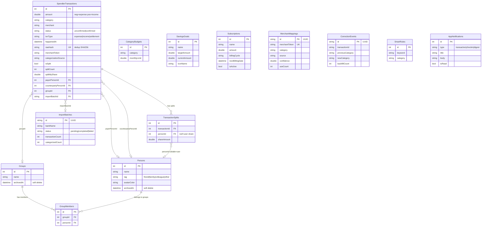

# CoinFlo — Codebase Architecture Audit

## 1. HIGH-LEVEL SYSTEM OVERVIEW

- **What is this application?**
  CoinFlo is a local-first personal finance tracking app built with Flutter. It uses SQLite (via Drift ORM) for offline-first data storage with optional Firebase cloud backup for user profiles and onboarding data. It features AI-powered transaction categorization via Google Gemini, bill splitting, budget tracking, savings goals, subscription management, and a rule-based chat assistant.

- **Problem & audience:**
  Helps individual users (primarily Indian market) track daily spending, set budgets, split expenses with friends/family, and gain insights into spending habits — all without requiring a bank account connection.

- **Major functional domains:**
  - **Auth** — Firebase email/password authentication + secure local token storage
  - **Transactions** — CRUD, categorization, filtering, search, confirmation workflow
  - **Budgets & Goals** — Category-level budget limits, savings goal tracking
  - **People & Debts** — Friend/family contacts, group expenses, split settlements
  - **Reports & Analytics** — Charts, category breakdowns, projections, CSV export
  - **AI** — Gemini-powered categorization, rule-based chat assistant (Saraswati/Penny)
  - **Notifications** — Daily check-in reminders, weekly digests, budget alerts
  - **Import/Export** — Excel import, CSV export, receipt attachments
  - **Onboarding** — 8-step guided setup (currency, accounts, budgets, goals)

- **Top-level services/processes:**
  - `SpendlerApp` (Flutter app entry point)
  - `SpendlerDatabase` (Drift SQLite — 19 tables, version 10)
  - `LocalRepository` (aggregate repository over 12 domain repositories)
  - `AuthService` (Firebase Auth + FlutterSecureStorage)
  - `FirestoreService` (cloud profile sync)
  - `CategorizationService` (5-stage cascade pipeline)
  - `CategoryClassifier` (Gemini LLM fallback)
  - `NotificationService` / `NotificationScheduler` / `SpendingAlertService`
  - `SaraswatiService` (rule-based Q&A chat)
  - `ExcelImportService` / `CsvExporter`
  - `SplitCalculator` / `AttachmentService`

---

## 2. ARCHITECTURE & COMPONENTS

- **Pattern:** Layered monolith (local-first) with optional cloud sync
  ```
  UI (Pages/Widgets) -> Riverpod Providers -> Repository Layer -> Drift Database (SQLite)
                                           -> Firebase Services (Auth, Firestore, AI)
  ```

- **Components:**

| Component | Purpose | Exposes |
|-----------|---------|---------|
| `lib/core/router.dart` | GoRouter navigation config | All route definitions, auth redirect |
| `lib/core/enums.dart` | App-wide enumerations | 14 enums (TransactionCategory, AccountType, etc.) |
| `lib/data/db.dart` | Drift SQLite database | 19 tables, 10 migrations, SpendlerDatabase class |
| `lib/data/repositories/` (19 files) | Domain data access | 12 repository interfaces + LocalRepository aggregate |
| `lib/providers/` (15+ files) | Riverpod state management | 40+ providers (streams, futures, state) |
| `lib/services/auth/` | Firebase authentication | signUp, signIn, signOut, authStateChanges |
| `lib/services/firestore/` | Cloud profile sync | createUser, getUserProfile, hydrateLocal |
| `lib/services/categorization/` (7 files) | 5-stage categorization pipeline | categorize(RawTransaction) -> CategorizationResult |
| `lib/services/ai/` | Gemini LLM classifier | classify(merchant) -> category + confidence |
| `lib/services/notifications/` (3 files) | Local push notifications | schedule, show, cancel notifications |
| `lib/services/saraswati/` | Rule-based chat assistant | ask(query) -> response string |
| `lib/services/export/` | CSV generation + sharing | generateCsv, exportAndShare |
| `lib/services/split/` | Bill splitting math | equal, exact, percentage, byShares |
| `lib/services/attachment_service.dart` | Receipt photo management | pickAndSave, delete |
| `lib/services/insight/` | Weekly insight generation | generateWeeklyInsight() -> String |
| `lib/services/migration/` | Legacy data migration | FriendContacts -> Persons migration |
| `lib/design_system/` (13 files + 10 widgets) | Design tokens & system components | Colors, text styles, spacing, radius, shadows, durations |
| `lib/pages/` (14 feature modules) | UI screens | 30+ pages/sheets |
| `lib/widgets/` (19 files) | Shared UI components | Buttons, charts, animations, bottom sheets |
| `lib/models/` (4 files) | Dart data classes | Account, Budget, Goal, RecurringPayment models |
| `lib/utils/` (2 files) | Utility functions | currencySymbol, accountLogoResolver |

- **External services:**
  - Firebase Auth (email/password)
  - Cloud Firestore (user profiles, onboarding data)
  - Firebase Crashlytics (error logging)
  - Firebase AI / Gemini 2.0 Flash (ML categorization)
  - Flutter Local Notifications (OS-level scheduling)

- **Infrastructure:**
  - **DB:** SQLite via Drift (local, 19 tables)
  - **Cloud DB:** Firestore (user profiles only, not transactional data)
  - **Secure Storage:** FlutterSecureStorage (auth tokens)
  - **Key-Value:** SharedPreferences (settings, onboarding state)
  - **File Storage:** Local filesystem (`app_documents/receipts/`)
  - **No queues, no caches, no CDN**

---

## 3. DATA FLOW & INTEGRATIONS

### Top 5 User-Facing Request Flows

**Flow 1: Add Transaction (QuickAddSheet)**
```
User -> FAB tap -> QuickAddSheet (modal)
  -> User enters amount, merchant, category, date
  -> CategorizationService.categorize() if auto-categorizing
    -> Stage 0: SmartRules (SQLite) -> Stage 1: MerchantMappings (SQLite)
    -> Stage 2: MerchantDictionary (JSON asset) -> Stage 3: UpiParser (regex)
    -> Stage 4: RuleEngine (regex) -> Stage 5: CategoryClassifier (Gemini API)
  -> repo.insertTransaction() -> Drift -> SQLite
  -> SpendingAlertService.checkBudgetAlerts() (fire-and-forget)
  -> Provider invalidation -> UI rebuilds
```

**Flow 2: Sign In**
```
User -> /sign-in -> enters email + password
  -> AuthService.signInWithEmail() -> Firebase Auth API
  -> On success: _storeAuthLocally() -> FlutterSecureStorage
  -> FirestoreService.hydrateLocalFromFirestore(uid) -> Firestore -> SharedPreferences
  -> Check SharedPreferences['onboarding_completed']
    -> true: redirect to /home
    -> false: redirect to /onboarding/step2
```

**Flow 3: View Report / Category Breakdown**
```
User -> Tab 1 (Report) -> ReportPage
  -> ref.watch(_monthCategoryTotalsProvider) -> TransactionRepository.watchCategoryTotals()
  -> Drift stream query -> SQLite (SUM amount GROUP BY category WHERE month)
  -> UI renders pie chart + category list
  -> Tap category row -> /report/category with {category, month}
    -> CategoryTransactionsPage -> filteredTransactionsProvider -> SQLite
```

**Flow 4: Split Expense with Friends**
```
User -> Transaction detail -> "Split" action chip
  -> SplitFlowSheet opens -> select people from Persons table
  -> SplitCalculator.equal/exact/percentage/byShares()
  -> repo.createSplits(transactionId, splitEntries) -> Drift -> SQLite
  -> Updates SpendlerTransactions (isSplit, splitCount, splitMyShare, splitPendingAmount)
  -> Inserts TransactionSplits rows
```

**Flow 5: Excel Import**
```
User -> Settings -> Import from Excel -> ExcelImportPage
  -> FilePicker -> select .xlsx file
  -> ExcelImportService.parseExcel(bytes)
    -> excel.decodeBytes() -> parse headers -> validate rows
    -> Returns ExcelParseResult {validRows, errors}
  -> User reviews preview -> confirms
  -> bulkInsert(rows, repo) -> repo.insertTransaction() x N -> SQLite
  -> Creates ImportBatch record
```

### Async Flows
- **Notification Scheduling:** `NotificationScheduler.setupAll()` at app start
  - Daily 9 PM: Evening check-in (if unconfirmed txns exist)
  - Sunday 7 PM: Weekly digest with spending summary
  - Subscription billing alerts (day before due date)
- **DB Cleanup:** `LocalRepository.purgeOlderThan(30)` at startup — removes old AppNotifications
- **Firebase Init:** Non-blocking `Firebase.initializeApp()` — app works offline if fails
- **No webhooks, no cron jobs, no event buses**

### Outbound Integrations
| Target | When | Protocol |
|--------|------|----------|
| Firebase Auth | Sign in/up/out | HTTPS (Firebase SDK) |
| Cloud Firestore | Profile create/read/update, onboarding hydration | HTTPS (Firebase SDK) |
| Firebase Crashlytics | On Flutter/platform errors | HTTPS (Firebase SDK) |
| Gemini 2.0 Flash | Categorization Stage 5 (fallback) | HTTPS (Firebase AI SDK) |
| OS Notification System | Scheduled reminders | FlutterLocalNotifications (native) |
| OS Share Sheet | CSV export, receipt sharing | share_plus (native) |

---

## 4. DATABASE SCHEMA

### All Tables (19 total, Drift/SQLite)

**SpendlerTransactions** (core)
| Field | Type | Constraints |
|-------|------|-------------|
| `id` | int | PK, autoincrement |
| `amount` | double | NOT NULL (negative=expense, positive=income) |
| `category` | string | NOT NULL |
| `merchant` | string? | nullable |
| `note` | string? | nullable |
| `happenedAt` | DateTime | NOT NULL, default NOW, indexed |
| `source` | string | NOT NULL, default 'manual' |
| `status` | string | NOT NULL, default 'confirmed', indexed |
| `isSplit` | bool | NOT NULL, default false |
| `splitCount` | int? | nullable |
| `splitMyShare` | double? | nullable |
| `splitPendingAmount` | double? | nullable |
| `splitSettled` | bool | NOT NULL, default false |
| `ledgerType` | string | NOT NULL, default 'personal' |
| `syncId` | string? | nullable |
| `createdAt` | DateTime | NOT NULL, default NOW |
| `rawHash` | string? | nullable, UNIQUE index |
| `merchantToken` | string? | nullable, indexed |
| `categorizationSource` | string? | nullable |
| `categorizationConfidence` | double? | nullable |
| `importBatchId` | string? | nullable, indexed |
| `isAnomaly` | bool | NOT NULL, default false |
| `isRecurring` | bool | NOT NULL, default false |
| `incomeSource` | string? | nullable |
| `attachmentPath` | string? | nullable |
| `txnType` | string | NOT NULL, default 'expense' |
| `payerPersonId` | int? | FK -> Persons |
| `counterpartyPersonId` | int? | FK -> Persons |
| `settlementDirection` | string? | nullable |
| `groupId` | int? | FK -> Groups |

**Persons** (v10)
| Field | Type | Constraints |
|-------|------|-------------|
| `id` | int | PK, autoincrement |
| `name` | string | NOT NULL, max 50 |
| `tag` | string? | nullable (friend/family/colleague/other) |
| `avatarColor` | string | NOT NULL (hex) |
| `note` | string? | nullable |
| `createdAt` | DateTime | NOT NULL, default NOW |
| `archivedAt` | DateTime? | nullable (soft delete) |

**Groups** (v10)
| Field | Type | Constraints |
|-------|------|-------------|
| `id` | int | PK, autoincrement |
| `name` | string | NOT NULL, max 50 |
| `description` | string? | nullable |
| `createdAt` | DateTime | NOT NULL, default NOW |
| `archivedAt` | DateTime? | nullable (soft delete) |

**GroupMembers** (v10)
| Field | Type | Constraints |
|-------|------|-------------|
| `id` | int | PK, autoincrement |
| `groupId` | int | FK -> Groups |
| `personId` | int | FK -> Persons |
| `createdAt` | DateTime | NOT NULL, default NOW |

**TransactionSplits** (v10)
| Field | Type | Constraints |
|-------|------|-------------|
| `id` | int | PK, autoincrement |
| `transactionId` | int | FK -> SpendlerTransactions |
| `personId` | int? | nullable (null = user's share), FK -> Persons |
| `shareAmount` | double | NOT NULL |
| `createdAt` | DateTime | NOT NULL, default NOW |
| — | — | Composite index: (personId, transactionId) |

**FamilyEntries**
| Field | Type | Constraints |
|-------|------|-------------|
| `id` | int | PK, autoincrement |
| `type` | string | NOT NULL (inflow/investment) |
| `amount` | double | NOT NULL |
| `fromPerson` | string | NOT NULL |
| `note` | string? | nullable |
| `happenedAt` | DateTime | NOT NULL, default NOW |
| `investmentType` | string? | nullable |
| `syncId` | string? | nullable |
| `createdAt` | DateTime | NOT NULL, default NOW |

**FriendContacts** (legacy, migrated to Persons)
| Field | Type | Constraints |
|-------|------|-------------|
| `id` | int | PK, autoincrement |
| `name` | string | NOT NULL, max 30 |
| `note` | string? | nullable |
| `avatarColour` | string | NOT NULL (hex) |
| `createdAt` | DateTime | NOT NULL, default NOW |

**FriendSplits** (legacy, migrated to TransactionSplits)
| Field | Type | Constraints |
|-------|------|-------------|
| `id` | int | PK, autoincrement |
| `transactionId` | int | FK -> SpendlerTransactions |
| `friendContactId` | int | FK -> FriendContacts |
| `amount` | double | NOT NULL |
| `direction` | string | NOT NULL (they_owe_me/i_owe_them) |
| `isSettled` | bool | NOT NULL, default false |
| `isWrittenOff` | bool | NOT NULL, default false |
| `settledAt` | DateTime? | nullable |
| `settlementMethod` | string? | nullable |
| `createdAt` | DateTime | NOT NULL, default NOW |
| `status` | string | NOT NULL, default 'uncleared' (v8) |
| `amountCleared` | double | NOT NULL, default 0.0 (v8) |

**WeeklyReflections**
| Field | Type | Constraints |
|-------|------|-------------|
| `id` | int | PK, autoincrement |
| `weekStartDate` | DateTime | NOT NULL |
| `totalSpent` | double | NOT NULL |
| `topCategory` | string | NOT NULL |
| `openedAt` | DateTime? | nullable |
| `llmReportGeneratedAt` | DateTime? | nullable |
| `createdAt` | DateTime | NOT NULL, default NOW |

**Subscriptions**
| Field | Type | Constraints |
|-------|------|-------------|
| `id` | int | PK, autoincrement |
| `name` | string | NOT NULL |
| `amount` | double | NOT NULL |
| `billingCycle` | string | NOT NULL (weekly/monthly/yearly) |
| `nextBillingDate` | DateTime | NOT NULL |
| `category` | string | NOT NULL |
| `isActive` | bool | NOT NULL, default true |
| `createdAt` | DateTime | NOT NULL, default NOW |

**CategoryBudgets**
| Field | Type | Constraints |
|-------|------|-------------|
| `id` | int | PK, autoincrement |
| `category` | string | NOT NULL (TransactionCategory) |
| `monthlyLimit` | double | NOT NULL |
| `createdAt` | DateTime | NOT NULL, default NOW |

**SavingsGoals**
| Field | Type | Constraints |
|-------|------|-------------|
| `id` | int | PK, autoincrement |
| `name` | string | NOT NULL |
| `targetAmount` | double | NOT NULL |
| `currentAmount` | double | NOT NULL, default 0.0 |
| `iconName` | string | NOT NULL |
| `createdAt` | DateTime | NOT NULL, default NOW |

**UserAccounts**
| Field | Type | Constraints |
|-------|------|-------------|
| `id` | int | PK, autoincrement |
| `name` | string | NOT NULL |
| `type` | string | NOT NULL (cash/bank/creditCard/digitalWallet) |
| `createdAt` | DateTime | NOT NULL, default NOW |

**SmartRules**
| Field | Type | Constraints |
|-------|------|-------------|
| `id` | int | PK, autoincrement |
| `keyword` | string | NOT NULL |
| `category` | string | NOT NULL |
| `createdAt` | DateTime | NOT NULL, default NOW |

**MerchantMappings** (v7)
| Field | Type | Constraints |
|-------|------|-------------|
| `id` | string | PK (UUID) |
| `merchantToken` | string | NOT NULL, UNIQUE with source |
| `category` | string | NOT NULL |
| `source` | string | NOT NULL (MappingSource) |
| `confidence` | double | NOT NULL |
| `createdAt` | DateTime | NOT NULL |
| `updatedAt` | DateTime | NOT NULL |
| `useCount` | int | NOT NULL, default 0 |

**CorrectionEvents** (v7)
| Field | Type | Constraints |
|-------|------|-------------|
| `id` | string | PK (UUID) |
| `transactionId` | string | NOT NULL |
| `previousCategory` | string? | nullable |
| `newCategory` | string | NOT NULL |
| `previousSource` | string | NOT NULL |
| `correctedAt` | DateTime | NOT NULL |
| `backfillCount` | int | NOT NULL, default 0 |

**ImportBatches** (v7)
| Field | Type | Constraints |
|-------|------|-------------|
| `id` | string | PK (UUID) |
| `bankName` | string | NOT NULL (BankType) |
| `fileName` | string | NOT NULL |
| `importedAt` | DateTime | NOT NULL |
| `transactionCount` | int | NOT NULL |
| `categorizedCount` | int | NOT NULL |
| `uncategorizedCount` | int | NOT NULL |
| `duplicateCount` | int | NOT NULL, default 0 |
| `status` | string | NOT NULL (ImportStatus) |
| `errorMessage` | string? | nullable |

**AppMetrics**
| Field | Type | Constraints |
|-------|------|-------------|
| `id` | int | PK, autoincrement |
| `metricType` | string | NOT NULL |
| `recordedAt` | DateTime | NOT NULL, default NOW |
| `metadata` | string? | nullable |

**AppNotifications**
| Field | Type | Constraints |
|-------|------|-------------|
| `id` | int | PK, autoincrement |
| `type` | string | NOT NULL (transaction/checkin/digest) |
| `title` | string | NOT NULL |
| `body` | string | NOT NULL |
| `sentAt` | DateTime | NOT NULL, default NOW |
| `isRead` | bool | NOT NULL, default false |

### Relationships
- `TransactionSplits.transactionId` -> `SpendlerTransactions.id` (many-to-one)
- `TransactionSplits.personId` -> `Persons.id` (many-to-one, nullable)
- `GroupMembers.groupId` -> `Groups.id` (many-to-one)
- `GroupMembers.personId` -> `Persons.id` (many-to-one)
- `SpendlerTransactions.payerPersonId` -> `Persons.id` (many-to-one, nullable)
- `SpendlerTransactions.counterpartyPersonId` -> `Persons.id` (many-to-one, nullable)
- `SpendlerTransactions.groupId` -> `Groups.id` (many-to-one, nullable)
- `SpendlerTransactions.importBatchId` -> `ImportBatches.id` (many-to-one, nullable)
- `FriendSplits.transactionId` -> `SpendlerTransactions.id` (legacy)
- `FriendSplits.friendContactId` -> `FriendContacts.id` (legacy)
- `Groups <-> Persons` via `GroupMembers` (many-to-many)

### Patterns
- **Soft delete:** `Persons.archivedAt`, `Groups.archivedAt` (nullable DateTime)
- **Deduplication:** `SpendlerTransactions.rawHash` (SHA256 of date|amount|desc, unique)
- **Migration path:** FriendContacts/FriendSplits -> Persons/TransactionSplits (v10)

---

## 5. API SURFACE

- **No HTTP API endpoints** — this is a client-only mobile app
- **No WebSocket channels or gRPC services**
- **No internal RPC calls**

### Firebase SDK Calls (outbound only)
| Service | Operation | When |
|---------|-----------|------|
| Firebase Auth | `signInWithEmailAndPassword` | User sign-in |
| Firebase Auth | `createUserWithEmailAndPassword` | User sign-up |
| Firebase Auth | `signOut` | User logout |
| Firestore | `collection('users').doc(uid).set()` | Profile creation |
| Firestore | `collection('users').doc(uid).get()` | Profile hydration |
| Firestore | `collection('users').doc(uid).update()` | Profile update |
| Firestore | `doc(uid).collection('accounts/budgets/goals/payments')` | Onboarding sync |
| Firebase AI | `generativeModel('gemini-2.0-flash').generateContent()` | ML categorization |
| Crashlytics | `recordFlutterFatalError`, `recordError` | Error logging |

### Navigation Routes (GoRouter)
| Path | Page | Params |
|------|------|--------|
| `/splash` | SplashPage | — |
| `/sign-in` | SignInScreen | — |
| `/onboarding/step2` through `/onboarding/step9` | 8 onboarding screens | — |
| `/home` | ShellPage (4-tab shell) | — |
| `/transaction/:id` | TransactionDetailPage | `id` (path), `startInEditMode` (extra) |
| `/daily-view` | DailyViewPage | `date` (extra: DateTime) |
| `/attachment-viewer` | AttachmentViewerPage | `filePath` (extra: String) |
| `/report/category` | CategoryTransactionsPage | `{category, month}` (extra: Map) |
| `/settings/saraswati` | SaraswatiPage | — |
| `/settings/people` | PeoplePage | — |
| `/settings/subscriptions` | SubscriptionsPage | — |
| `/settings/excel-import` | ExcelImportPage | — |
| `/people/:id` | PersonDetailPage | `id` (path) |
| `/groups` | GroupsPage | — |
| `/groups/:id` | GroupDetailPage | `id` (path) |

---

## 6. STATE MACHINES & LIFECYCLES

### SpendlerTransaction.status
```
States: unconfirmed -> confirmed
Trigger: User taps "Confirm" or "Confirm All"
Side-effect: Provider invalidation, notification check
Guard: None
```

### SpendlerTransaction.txnType
```
States: expense | income | transfer | settlement
Set at creation time, immutable after
```

### FriendSplit.status (legacy, v8+)
```
States: uncleared -> partiallyCleared -> cleared
Triggers:
  uncleared -> partiallyCleared: partial payment recorded (amountCleared < amount)
  uncleared -> cleared: full payment or write-off
  partiallyCleared -> cleared: remaining amount paid
Side-effects: Updates amountCleared, settledAt, settlementMethod
```

### ImportBatch.status
```
States: pending -> completed | failed
Trigger: Excel import process completion
Side-effect: Sets transactionCount, categorizedCount, errorMessage
```

### Subscription.isActive
```
States: true (active) -> false (cancelled)
Trigger: User deactivates subscription
Side-effect: Stops billing date notifications
```

### SavingsGoal lifecycle
```
States: active (currentAmount < targetAmount) -> completed (currentAmount >= targetAmount)
Trigger: User adds money via AddMoneySheet
Side-effect: Celebration animation, health recalculation
Health: completed | onTrack | atRisk | behind (computed from progress vs time)
```

### Persons.archivedAt (soft delete)
```
States: active (archivedAt == null) -> archived (archivedAt != null)
Trigger: User archives person
Guard: Check for unsettled splits before archiving
```

### Onboarding flow
```
States: step2 -> step3 -> step4 -> step5 -> step6 -> step7 -> step8 -> step9 (completion)
Trigger: User completes each screen and taps Continue
Side-effect: SharedPreferences['onboarding_completed'] = true at step9
Guard: Auth redirect checks this flag on every route
```

---

## 7. CLASS & MODULE STRUCTURE

### Key Classes & Interfaces

**Repository Layer (Interface Segregation):**
```
BaseRepository (abstract)
  |-- implements TransactionRepository    (22 methods: CRUD, watch, analytics)
  |-- implements FamilyRepository         (insert, watch, delete family entries)
  |-- implements ReflectionRepository     (weekly reflections CRUD)
  |-- implements MetricsRepository        (record, query app metrics)
  |-- implements NotificationRepository   (CRUD, purge old notifications)
  |-- implements FriendSplitRepository    (balances, settlements)
  |-- implements SubscriptionRepository   (CRUD, watch subscriptions)
  |-- implements BudgetRepository         (CRUD category budgets)
  |-- implements GoalRepository           (CRUD savings goals, add money)
  |-- implements PersonRepository         (CRUD persons, tag filter, archive)
  |-- implements GroupRepository          (CRUD groups, members)
  |-- implements SplitRepository          (CRUD transaction splits)

LocalRepository (concrete)
  |-- delegates to 12 Local*Repository classes -> SpendlerDatabase
```

**Service Layer:**
```
AuthService (singleton)
  |-- FirebaseAuth instance
  |-- FlutterSecureStorage instance

FirestoreService
  |-- CloudFirestore instance

CategorizationService
  |-- uses RuleEngine (regex patterns)
  |-- uses MerchantDictionary (JSON asset)
  |-- uses UpiParser (VPA regex)
  |-- uses TransactionNormalizer (text cleanup)
  |-- uses LearningLoop (correction feedback)
  |-- uses CategoryClassifier (Gemini fallback)

NotificationService (singleton)
  |-- FlutterLocalNotificationsPlugin

SaraswatiService
  |-- BaseRepository (injected)
```

**State Management (Riverpod):**
```
databaseProvider -> SpendlerDatabase (singleton)
repositoryProvider -> LocalRepository (depends on databaseProvider)
authStateProvider -> Stream<User?> from FirebaseAuth
selectedCurrencyProvider -> SharedPreferences
monthlyBudgetProvider -> SharedPreferences
transactionFiltersProvider -> StateProvider<TransactionFilters>
filteredTransactionsProvider -> depends on (transactionFiltersProvider, repositoryProvider)
selectedTabProvider -> StateProvider<int>
selectedMonthProvider -> StateProvider<DateTime>
```

**Design Patterns:**
- **Repository Pattern** — Abstract data access behind interfaces
- **Singleton** — AuthService, NotificationService, SpendlerDatabase
- **Strategy** — SplitCalculator (equal/exact/percentage/shares)
- **Chain of Responsibility** — CategorizationService 5-stage cascade
- **Observer** — Riverpod stream providers for reactive UI
- **Delegate/Composite** — LocalRepository delegates to 12 sub-repositories
- **Factory** — GoRouter route builders

---

## 8. DEPLOYMENT & INFRASTRUCTURE

- **Deployment topology:**
  - Mobile app (Android APK) — all business logic runs on-device
  - Firebase project `portfolio-11501` (Auth, Firestore, Crashlytics, AI) in `asia-southeast1`
  - No backend server, no API gateway

- **Environments:**
  - **Dev:** Debug build, debug signing, Crashlytics enabled
  - **Prod:** Release APK with `--no-tree-shake-icons`, debug signing (needs production keystore)
  - No staging environment
  - Single Firebase project for all environments

- **CI/CD:**
  - `.github/workflows/claude-code-review.yml` — Automated code review on PRs via Claude
  - `.github/workflows/claude.yml` — Claude responds to `@claude` mentions in issues/PRs
  - No automated build/test/deploy pipeline
  - Manual APK build: `flutter build apk --release --no-tree-shake-icons`

- **Git strategy:**
  - Single `main` branch
  - Direct push to main (no PR requirement enforced)
  - Conventional commits (`feat:`, `fix:`, `refactor:`, etc.)

---

## 9. AUTH & SECURITY FLOWS

- **Authentication mechanism:** Firebase Auth (email + password)

- **Full login flow:**
  ```
  1. User enters email + password on SignInScreen
  2. AuthService.signInWithEmail() -> FirebaseAuth.signInWithEmailAndPassword()
  3. Firebase returns User object with uid, email
  4. AuthService._storeAuthLocally() -> FlutterSecureStorage.write('auth_token', uid)
  5. FirestoreService.hydrateLocalFromFirestore(uid) -> reads user doc -> writes to SharedPreferences
  6. GoRouter redirect checks SharedPreferences['onboarding_completed']
  7. Routes to /home (if complete) or /onboarding/step2 (if not)
  ```

- **Returning user flow:**
  ```
  1. App launches -> SplashPage
  2. GoRouter redirect calls AuthService.isReturningUser() -> FlutterSecureStorage.read('auth_token')
  3. If token exists -> route to /home (skip sign-in)
  4. If no token -> route to /sign-in
  ```

- **Authorization model:**
  - No RBAC/ABAC — single-user app
  - Firestore rules enforce `isOwner(userId)` — users can only read/write their own data
  - All local SQLite data is user-scoped (single user per device)

- **Sensitive data handling:**
  - Auth tokens: `FlutterSecureStorage` (Android EncryptedSharedPreferences, AES)
  - Transaction data: SQLite on local filesystem (OS-level encryption on Android)
  - Receipts: Local filesystem in app-private directory
  - Firebase API keys: Public SDK keys in `firebase_options.dart` (safe by design)
  - No PII transmitted to external services except Firebase Auth (email)
  - Gemini receives only merchant names for categorization (no amounts/dates)

---

## 10. ERROR HANDLING & OBSERVABILITY

- **Error types & propagation:**
  ```
  Flutter Widget Errors -> FlutterError.onError -> Crashlytics.recordFlutterFatalError
  Platform Errors -> PlatformDispatcher.onError -> Crashlytics.recordError
  Async Errors -> runZonedGuarded -> Crashlytics.recordError
  Service Errors -> try/catch in service methods -> return null / show SnackBar
  Provider Errors -> AsyncValue.error -> UI shows ErrorCard or error text
  ```

- **Retry patterns:**
  - No explicit retry logic
  - Firebase init is non-blocking — app degrades gracefully without Firebase
  - `SpendingAlertService.checkBudgetAlerts()` swallows all exceptions (fire-and-forget)
  - No dead-letter queues (no async message processing)

- **Observability:**
  - **Crashlytics:** All uncaught errors logged automatically
  - **AppMetrics table:** Records `app_open`, `retrospection`, `llm_report`, `week_confirmed` events with timestamps
  - **No structured logging** — `avoid_print: true` lint rule enforced
  - **No APM/tracing** — no performance monitoring
  - **No analytics SDK** — no user behavior tracking beyond AppMetrics

---

## Mermaid Flowcharts

### Flowchart 1: App Launch & Authentication Flow

```mermaid
flowchart TD
    A([App Launch]) --> B[main.dart: runZonedGuarded]
    B --> C{Firebase.initializeApp}
    C -->|Success| D[Setup Crashlytics]
    C -->|Failure| E[Continue without Firebase]
    D --> F[NotificationService.initialize]
    E --> F
    F --> G[Purge old notifications > 30d]
    G --> H[SpendlerApp / GoRouter]

    H --> I[/splash route/]
    I --> J{AuthService.isReturningUser?}
    J -->|Token in SecureStorage| K{SharedPrefs: onboarding_completed?}
    J -->|No token| L[/sign-in/]

    K -->|true| M[/home/ ShellPage]
    K -->|false| N[/onboarding/step2/]

    L --> O[User enters email + password]
    O --> P[AuthService.signInWithEmail]
    P --> Q[Firebase Auth API]
    Q -->|Success| R[_storeAuthLocally -> SecureStorage]
    Q -->|Failure| S[Show error SnackBar]
    S --> O
    R --> T[FirestoreService.hydrateLocalFromFirestore]
    T --> U[Firestore -> SharedPreferences]
    U --> K

    N --> V[8-step onboarding flow]
    V --> W[step2: Currency]
    W --> X[step3: Accounts]
    X --> Y[step4: Track Income]
    Y --> Z[step5: Categories]
    Z --> AA[step6: Budgets]
    AA --> AB[step7: Recurring Payments]
    AB --> AC[step8: Savings Goals]
    AC --> AD[step9: Completion]
    AD --> AE["SharedPrefs onboarding_completed = true"]
    AE --> AF[FirestoreService.createUserWithOnboardingData]
    AF --> M

    style A fill:#1a1a1a,color:#fff
    style M fill:#22C55E,color:#fff
    style S fill:#EF4444,color:#fff
    style Q fill:#F59E0B,color:#000
```

### Flowchart 2: Transaction Categorization Pipeline



### Flowchart 3: Layered Architecture Overview



### Flowchart 4: Transaction Lifecycle State Machine



### Flowchart 5: Navigation Graph

```mermaid
flowchart LR
    SPLASH([/splash]) --> SIGNIN[/sign-in]
    SPLASH --> ONBOARD[/onboarding/step2-9]
    SPLASH --> SHELL

    SIGNIN --> ONBOARD
    SIGNIN --> SHELL
    ONBOARD --> SHELL

    subgraph SHELL["/home - ShellPage 4 tabs"]
        direction TB
        TAB0["Tab 0\nHomePage"]
        TAB1["Tab 1\nTransactionsPage"]
        TAB2["Tab 2\nPlanPage"]
        TAB3["Tab 3\nSettingsPage"]
        FAB(("+ FAB\nQuickAddSheet"))
    end

    TAB0 --> DAILY["/daily-view"]
    TAB0 -->|See all| TAB1

    TAB1 --> TXNDETAIL["/transaction/:id"]
    TXNDETAIL --> ATTACH_VIEW["/attachment-viewer"]
    TXNDETAIL -->|modal| SPLIT_SHEET["SplitFlowSheet"]

    TAB1 -->|modal| FILTER["FilterSheet"]

    TAB2 -->|modal| ADD_BUDGET["AddBudgetSheet"]
    TAB2 -->|modal| ADD_GOAL["AddGoalSheet"]

    TAB3 --> SARA["/settings/saraswati"]
    TAB3 --> PEOPLE_LIST["/settings/people"]
    TAB3 --> SUBS["/settings/subscriptions"]
    TAB3 --> EXCEL["/settings/excel-import"]
    TAB3 -->|modal| PROFILE["ProfileSheet"]

    PEOPLE_LIST --> PERSON["/people/:id"]
    TAB3 --> GROUPS["/groups"]
    GROUPS --> GROUP_DETAIL["/groups/:id"]

    TAB1 -->|report link| CAT_TXN["/report/category"]

    style SHELL fill:#F0F0F0,color:#0A0A0A
    style FAB fill:#0A0A0A,color:#fff
    style SPLASH fill:#1a1a1a,color:#fff
```

### Flowchart 6: Entity-Relationship Diagram


