# Saraswati Entry Pipeline — Mermaid Diagrams

## 1. High-Level Architecture

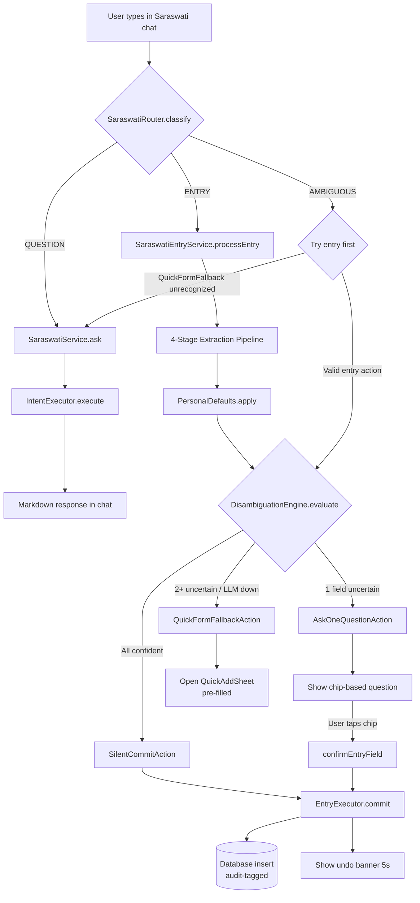

## 2. Router Decision Logic

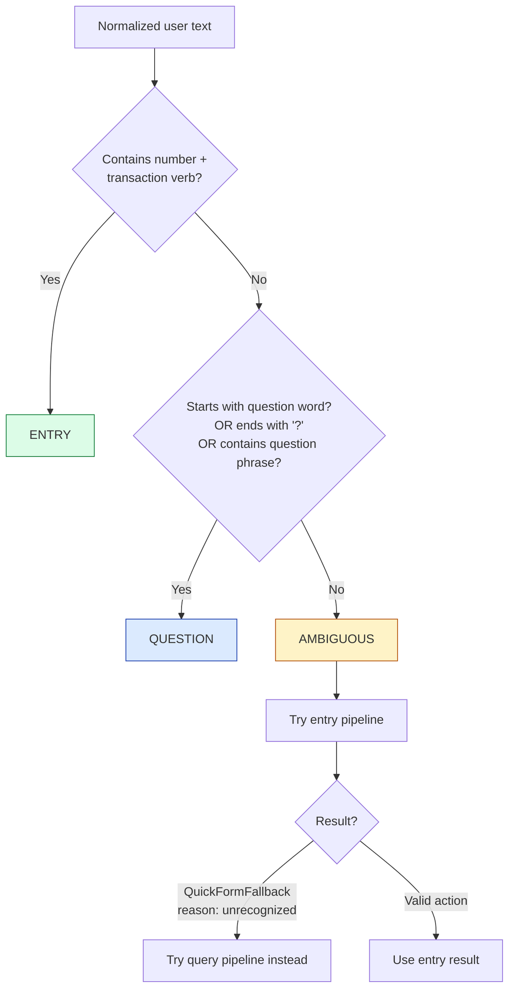

## 3. 4-Stage Extraction Pipeline

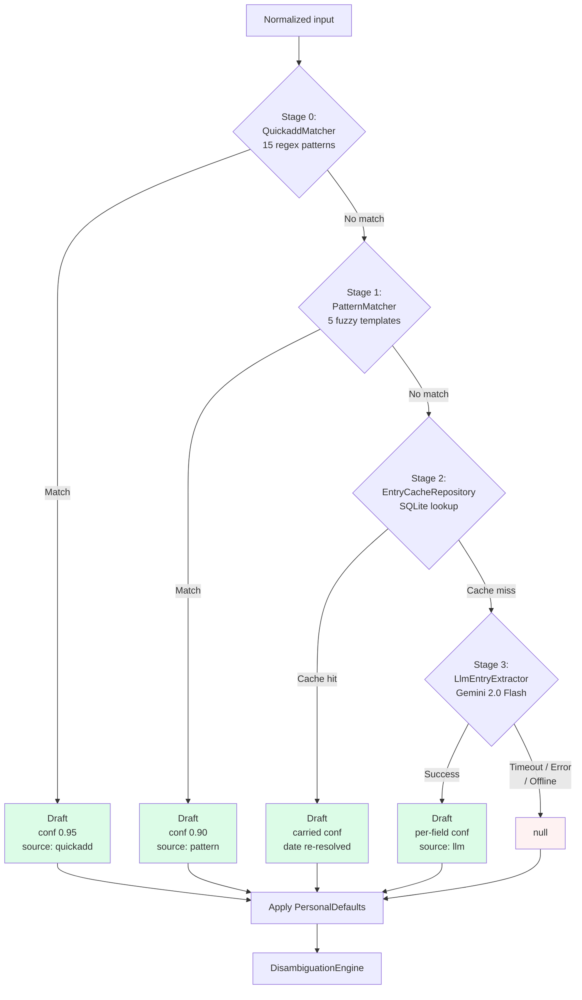

## 4. Disambiguation Decision Matrix

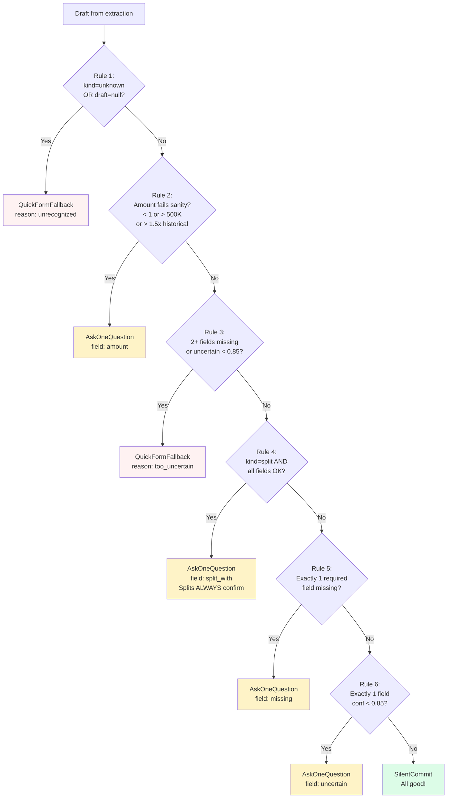

## 5. Data Model — TransactionDraft

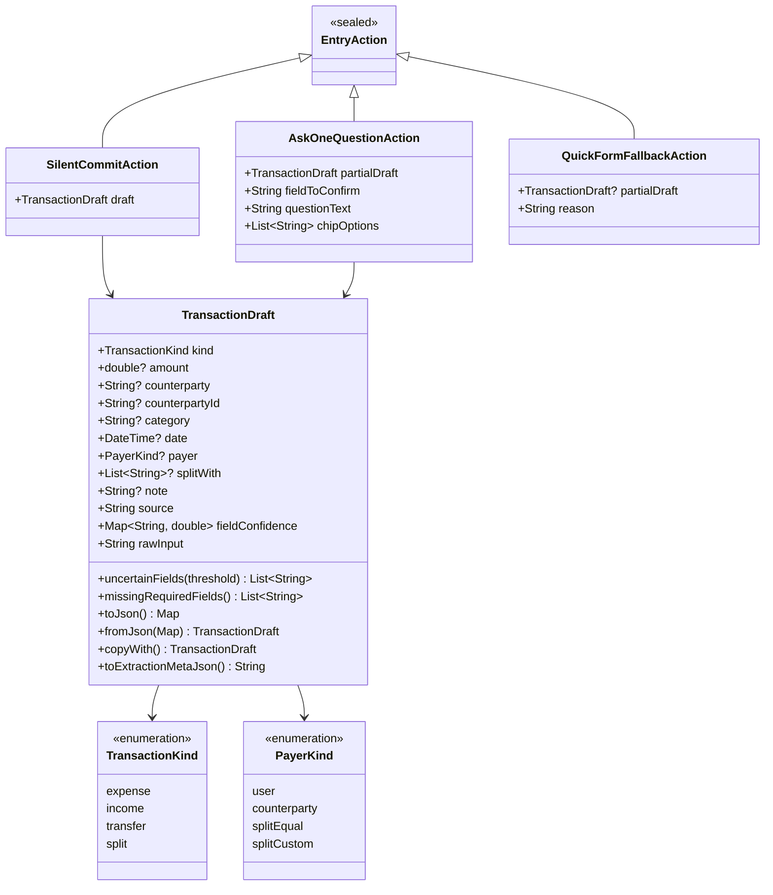

## 6. Provider Dependency Graph

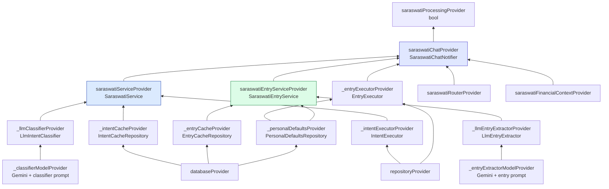

## 7. Chat Notifier State Flow

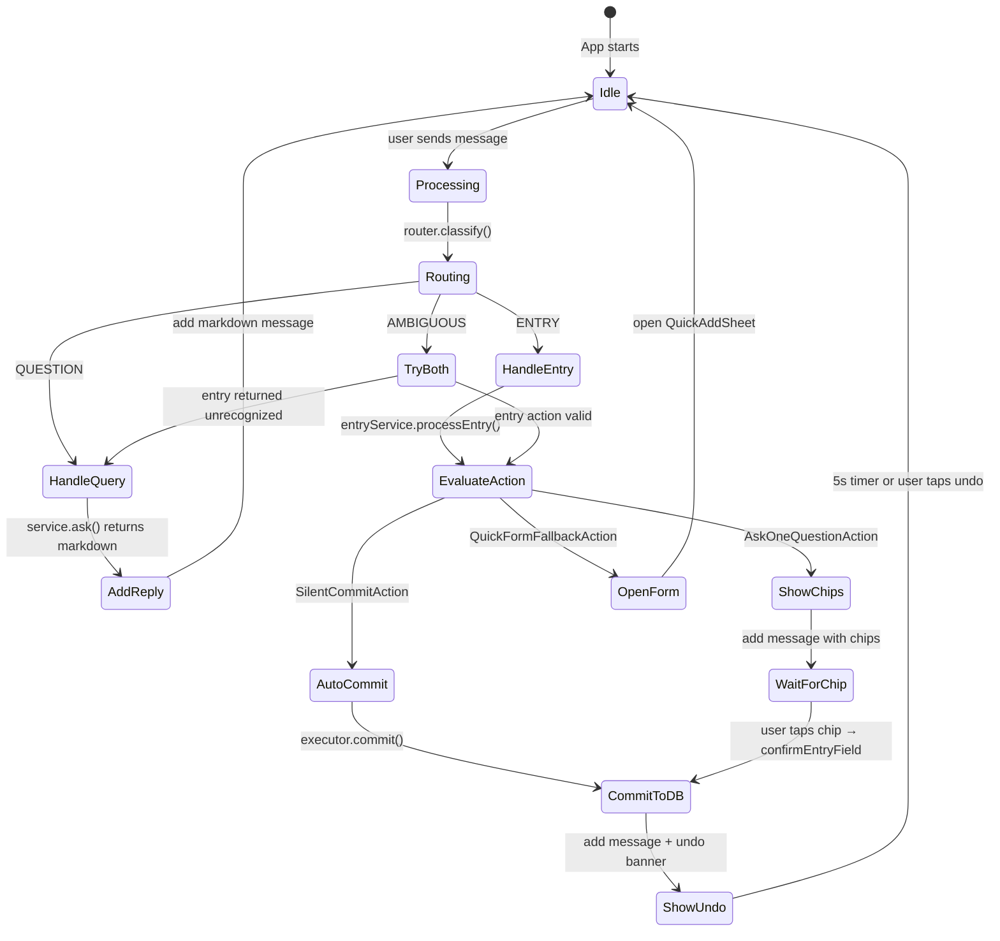

## 8. Undo Timeline

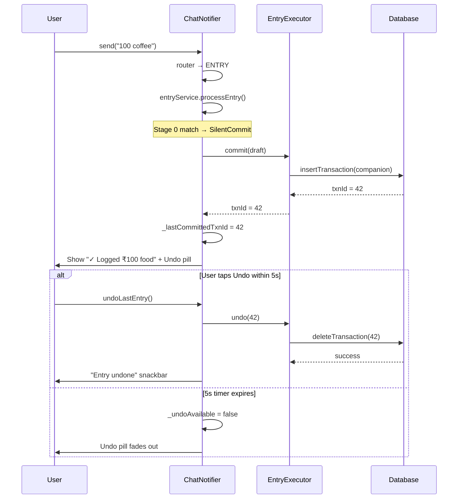

## 9. Personal Defaults Learning

```mermaid
flowchart LR
    A[User commits\n"split 600 with rahul"] --> B[EntryExecutor._learnDefaults]
    B --> C{counterparty\n= rahul?}
    C -->|Yes| D[updateDefault\nkey: counterparty:rahul\nvalue: splitEqual]
    B --> E{splitWith\nnames?}
    E -->|rahul, priya| F[updateDefault\ncounterparty:rahul → splitEqual\ncounterparty:priya → splitEqual]
    B --> G{counterparty +\ncategory?}
    G -->|zomato + food| H[updateDefault\ncategory_for:zomato → food]

    I[Next time user types\n"500 rahul"] --> J[Extract draft\nkind=expense]
    J --> K[_applyDefaults]
    K --> L{getDefault\ncounterparty:rahul}
    L -->|splitEqual| M[Upgrade to\nkind=split\npayer=splitEqual\nconf 0.90]
```

## 10. Database Schema v13

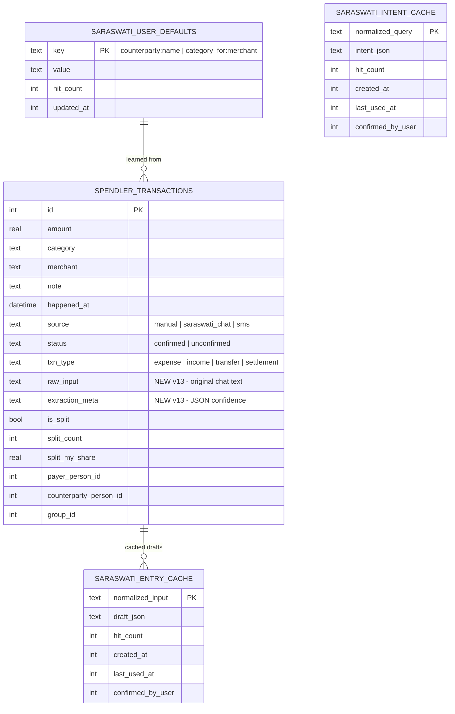

## 11. UI Component Tree (Entry Flow)

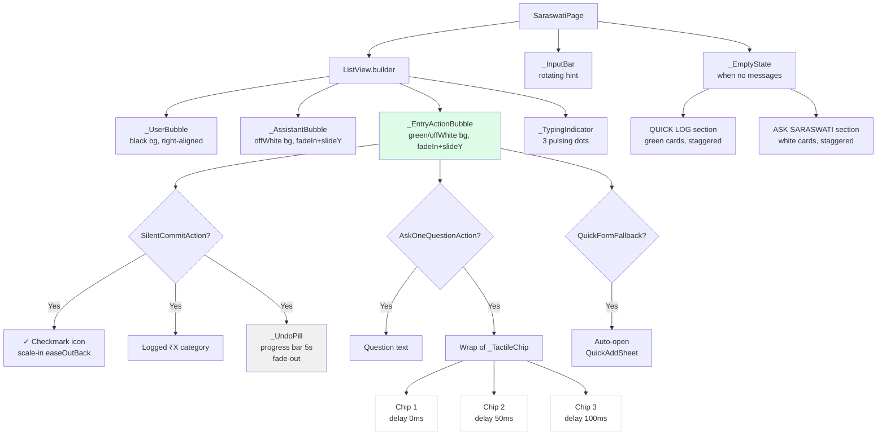

## 12. Confidence Flow

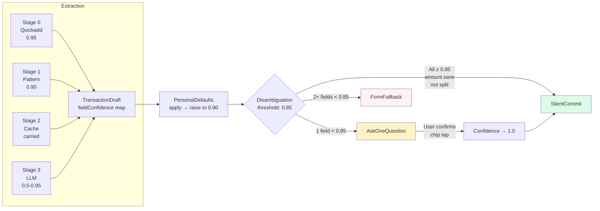
